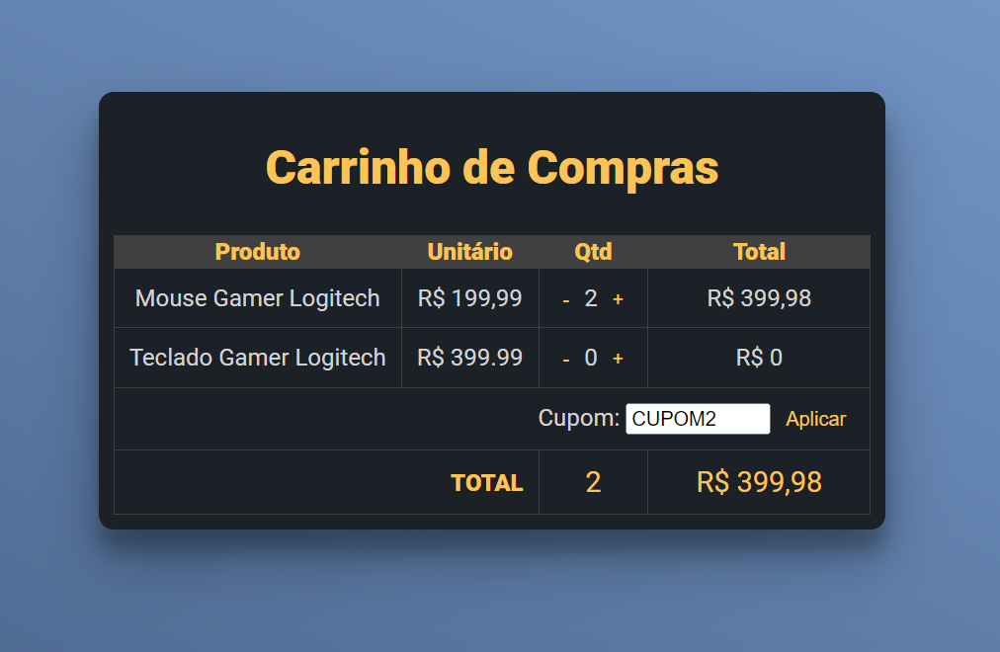

Carrinho de Compras com HTML, CSS e JavaScript
==============================================

Este é um simples carrinho de compras feito com as seguintes tecnologias:

*   HTML
*   CSS
*   JavaScript

Funcionalidades
---------------

*   Adicionar itens ao carrinho
*   Remover itens do carrinho
*   Atualizar a quantidade de itens no carrinho
*   Calcular o preço total da compra

Como usar
---------

Basta baixar os arquivos deste repositório e abrir o arquivo `carrinho-de-compras.html` em seu navegador web.

```bash
git clone https://github.com/canis-lupus-solutions/teste-001-sergio.git
cd teste-001-sergio
```

Estrutura de diretórios
-----------------------

O projeto está organizado da seguinte forma:

```text
carrinho-de-compras/
├── css/
│   ├── style.css
├── js/
│   ├── script.js
└── carrinho-de-compras.html
```

Os arquivos `style.css` e `script.js` contêm todo o estilo e funcionalidade, respectivamente. O arquivo `carrinho-de-compras.html` é onde todo o conteúdo do carrinho de compras é exibido.

Exemplo de Uso
--------------



Contribuições
-------------

Contribuições são sempre bem-vindas. Sinta-se à vontade para abrir uma issue ou enviar um pull request se tiver alguma sugestão de melhoria ou adição ao projeto.

Autores
-------

*  [Leonardo de Aguiar](https://github.com/leoap)
*  [Sergio Falcetti](https://github.com/falcettijr)

Licença
-------

Este projeto está licenciado sob a licença MIT. Você pode ler mais sobre isso [aqui](https://opensource.org/licenses/MIT).